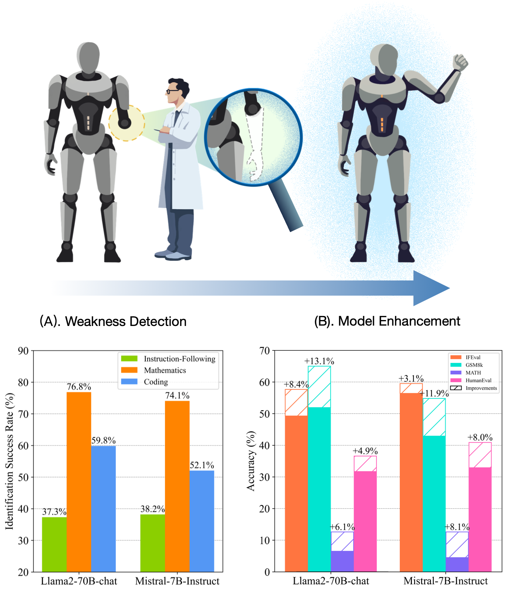

# AutoDetect:
## Towards a Unified Framework for Automated Weakness Detection in Large Language Models

<p align="center">
   🤗 <a href="#data" target="_blank">Data</a> 
   • 📃 <a href="https://arxiv.org/abs/2406.16714" target="_blank">Paper</a>
</p>

Effective weakness discovery can well guide
model enhancement. AutoDetect can achieve high
identification success rates in the instruction-following,
mathematics and coding tasks (A). Moreover, leveraging
this data, we can further improve LLMs (B).

<div align="center">

</div>

<br>
<br>


## Table of Contents
- [Data](#data)
- [Quick Start](#quick-start)
    - [Setup](#setup)
    - [Weakness Detection](#weakness-detection)
- [Citation](#citation)


## Data


Our dataset can be found on [Hugging Face](https://huggingface.co/datasets/lrxl/AutoDetect-results).

We show data from the Autodetect process for the models listed in the paper, each in the following format:

```json
{
    "key_point": {key_point},
    "prompt": {prompt},
    "answer": {answer},
    "ref_ans": {ref_ans},
    "comparison": {comparison},
    "score": {score}
}
```
- {prompt}: The question used to evaluate the target LLM.
- {key_point}: The summary of the key knowledge encapsulated in the {prompt}.
- {answer}: The response generated by the target LLM.
- {ref_ans}: The reference response generated by GPT-4 Turbo.
- {comparison}: The comparison output from the LLM-judge (GPT-4 Turbo).
- {score}: The final evaluation score, ranging from 1 to 10.

By leveraging the `prompt` alongside the `ref_ans`, we can effectively enhance the performance of the target LLM.

## Quick Start
For all codes, we have added `#TODO` comments to indicate places in the code that need modification before running. Please update the relevant parts as noted before executing each file.


### Setup
```bash
pip install -r requirements.txt
```

### Weakness Detection
We provide the code for AutoDetect on Instruction-following, Mathematics and Coding tasks, the usage of which are exactly the same. 

Here we take Instruction-following task for example. To run AutoDetect, please run the following command.
```bash
cd autodetect_if/scripts
bash autodetect_if
```

The result will be stored under the path `autodetect_if/result`. 

To calculate the weakness identification success rate, run the following command:
```bash
python count_res.py
```


## Acknowledgement
- Fine-tuning code: [llm_finetuning](https://github.com/ssbuild/llm_finetuning)
- Evaluation scripts: [IFEval](https://github.com/google-research/google-research/tree/master/instruction_following_eval), [MetaMath](https://github.com/meta-math/MetaMath), and [HumanEval](https://github.com/openai/human-eval)


## Citation
```
@article{cheng2024autodetect,
  title={AutoDetect: Towards a Unified Framework for Automated Weakness Detection in Large Language Models},
  author={Cheng, Jiale and Lu, Yida and Gu, Xiaotao and Ke, Pei and Liu, Xiao and Dong, Yuxiao and Wang, Hongning and Tang, Jie and Huang, Minlie},
  journal={arXiv preprint arXiv:2406.16714},
  year={2024}
}
```